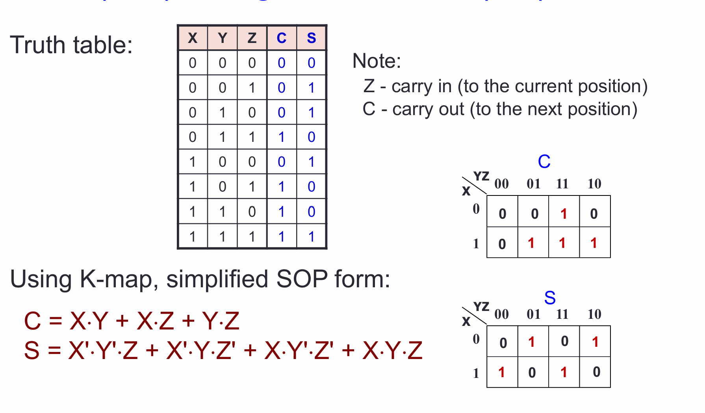
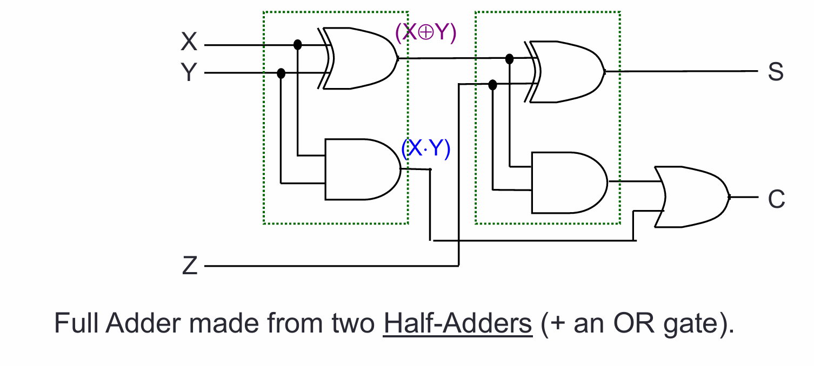
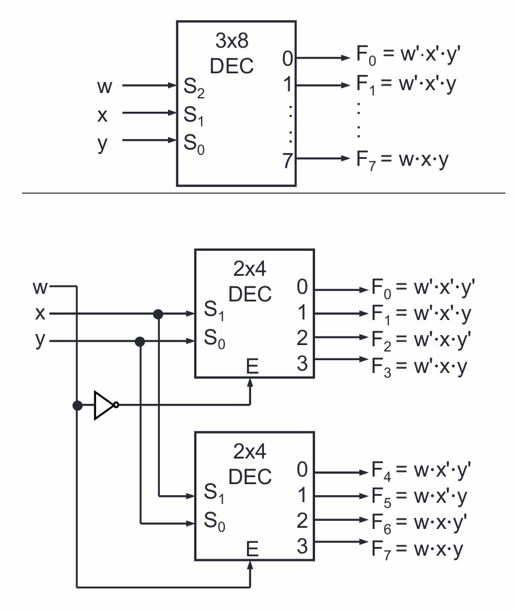

# CS2100 Lecture 1&2 Overview of C Programming

## 1. Edit, Compile , Execute
Edit -> Source Code -> Compile -> Executable code -> Execute -> Program output

## 2. A Simple C Programming

```
preprocessor directives
main function header
{
	declaration of variables
	executable statements
}
```
## 3. von Neumann Architecture
describes a computer consisting of :
* Central Processing Unit (CPU) 
	* Registers
	* A control unit containing an instruction register and program, counter
	* An arithmetic/logic unit(ALU)
* Memory 
	* Stores both program and data in random access memory(RAM) 
* I/O devices

## 4. Variables
* data stores in variables
* name, data type, value
* have an address
* initialization
* data types
	* int : 4 bytes,$ -2^{31}$ ~ $2^{31} -1$
	* float/double: 4/8 bytes
	* char
* strongly/weakly typed
-> gcc filename -o newname(o specifies name if executable file)

## 5. Program Structure
A basic C program has 4 main parts:
* Preprocessor directives :
	* Header files
		(need to use -lm when using math.h; string.h for strings)
	* Macro expansions
		`#define PI 3.142`(no ";")`
	* Conditional compilation
	* Input: stdin/file
	scanf(format string, input list)
	printf(format string)
	printf(format string, print list)
	|Placeholder|Variable Type|Function Use|
	|---|---|---|
	|%f|float/double|printf|
	|%f|float|scanf|
	|%lf|double|scanf|
	|%e|float/double|printf(for scientific notation)|	
	escape sequence:
	\n: new line; \t Horizental tab; \" Double quote; %% percent 

* Compute
	* Computation is through function
	* A function body have two parts:
		* Declaration statements:
		* Executable statements:
* Output: stdout/file

## Control Structures in C
1. Selection Structures
	* if else
	* switch case:
	``` 
	switch (variable or expression) {
		case value1:
			code to excecute
			break;
		...
		default:
		code to execute
		break;
	}
	```

	------

# L3
## 1.Data Representation

* Data are internallu represented as sequence if bits(binary digits). A bit is either 0 or 1.
* Other units 
	* Byte: 8 bits
	* Nibble: 4 bits
	* Word: Multiple butes
* N bis can represent up to $2^N$ values

## 2. Decimal (base 10) Number System
* A weight=positional number system.
* Base(radix) is 10
## 3. Other Number Systems
* Binary
* Octal
* Hexadecimal : 0123456789ABCDEF
* Base/Radix R
In C 
* Prefix 0 is for octal, eg 032 
* Prefix 0x is for hexadecimal
## 4. Base-R to Decimal Conversion
## 5. Decimal to Binary Conversion
* For whole numbers : Repeated Division-b-2 Method
* For fractions : Repeated Multiplication-by-2 Method
## 6. Conversion Between Bases 
1. via decimal
2. Shortcuts for conversion between bases 2,4,8,16
## 7. ASC2 Code
* American Standard Code for informaation Interchange
* 7 bits, plus 1 parity bit(odd or even parity)
## 8. Negative Numbers 
1. Sign and Magnitude
	The Sign is represeneted by a 'sign bit', 0 for +, 1 for -
	range $-2^{n-1}+1    to    2^{n-1}-1$
	To negate a number, just invert the sign bit
	The subscript sm, eg ${11001}_{sm}$  _
2. 1s Complement
	given number x , -x can be obtained using $-x = 2^n -x -1$
	technique to neagte: invert 1 and 0
	The MSB still represents the sign: 0 for positive , 1 for negative
	range : $-2^{n-1} + 1, 2^{n-1}-1$
3. 2s Complement
	 given number x ,$-x = 2^n -x$
	 invert 0,1 then +1
	 range : $-2^{n-1},2^{n-1}-1$
## 9. 2s Complement on addition/Subtraction
* Algorithm for addition of integers, A + B
	1. Perform binary addition on the two numbers.
	2. Ignore the carry out of the MSB
	3. Check for overflow. Overflow ovvurs if the 'carry in' and 'carry out' of the MSB are different, ot if the result is opposite sign of A and B.
* Algorithm for substraction of integers, A-B = A+(-B)
	1. Take 2s complement of B
	2. Add 2s complement of B to A
* Overflow:
	positive + positive -> negative
	negative + negative -> positive
## 10. 1s Complement on Addition/Subtraction
* Addition:
	1. Perform binary addition
	2. if there is a carry out of the MSB, add 1 to the result
	3. Check for overflow. Overflow occurs if result is opposite sign of A and B.
* Subtraction:
	1.Take B 1s complement
	2.Add 1s complement of B to A  
## 11. Excess Representation
It allows the range of values to be distributed evenly between the positive and negative values, by a simple translation
Excess-n means 00..0 = -n

## 12. Real Numbers
1. Fixed-Point Representation: the number of bits allocated for the whole number part and fractional par are fixed
2. Floating-Point Representation
	allow us to represent very large or very small numbers
	3 components: sign, exponent and mantissa(fraction)
	the base(radix) is assumed to be 2
	Two formats:
		Single-precision(32 bits): 1-bit sign, 8 bit exponent with bias -127(excess+127), 23 -bit mantissa
		Double-precision(64 bits): 1-bit sign, 11 bit exponent with bias -1023(excess+1023), and 52 bit mantissa
	* Sign bit : 0 for positive , 1 for negative
	* Mantissa is normalized with an implicit leading bit 1
		* $110.1_2$ -> normalized -> $1.101_2 * 2^2$ -> only 101 is stored in the mantissa field
		* $0.00101101_2$ -> normalised -> $1.01101_2 * 2^{-3}$ -> only 01101 is stored in the mantissa field
---
# L4 Pointers
## 1. Pointers
### 1.1 Pointer variable
* A variaible that contains the address of another variable
* To declare a pointer variable:
	syntax: type * pointername
* Assigning value to a pointer: assign the address to a pointer
* Accessing variable through pointer: indirection operation operator * 
* Incrementing a pointer: the address inrease depends on the type of the variable,int 4 bytes, floar 4 bytes,char 1, double 8
## 2. Functions
* Pass-by-value and Scope Rule:
---

# L5 Collection of data
## 1. Array
* An homogeneous collection of data, occupy contiguous memory locations, and are accessed through indexing

 ``
 	int a[3] = {1,2,3}
 	int b[] = {1,2,3}
 	int d[5] = {0}
 ``
### Array and pointers
C sees array as constant pointer
### Array oarameters in functions
`` int sumArray(int [], int) `` 
`` int sumArray(int *, int) `` 
No need to put array size inside[]
## 2. Strings
* Array of chars with \0 as an end, We can turn any array of chars into a string by add a\0 at the end
* Can use include <string .h> to manipulate
`` char fruit_name[] ="apple"
### Strings I/O
```
fgets(str, size, stdin); // reads size -1 char or until newline
scanf("%s", str); // read until white space
puts(str);
pritnf("%s\n", str) 
```
* fgets()
ON interactive input, fgets() also read in the newline character, Hence we may need to replace it with '\0', if necessary
```
fgets(stsr, size, stdin);
len = strlen(str);
if(str[len-1] == '\n')
	STR[LEN -1] = '\0';
```
### String Functions
* strlen
* strcmp : positive if s1 is lexicographically
* strncmp(s1, s2, n) first n chars
* strcpy(s1, s2): copy s2 into s1
* strncpy(s1, s2, n): copy first n chars of s2 to s1

## 3. Structure
Allow groupping of heterpgeneous members of different types
```
typedef struct {
int length, width, height;
} box_t;
box_t box = {1,1,1};
```
* A type is not a variable, No memory is allocatd to a type
* can do assignment woth structures : reslut1 = result2
* shortcut: ``(*player_ptr).name  = player-ptr->name``
---
# L 7 MIPS
## 1. Instruction Set Architecture
### 1.1
* An abstraction on the interface between the hardware and the low-level software:
	Software -> to be translated to the instruction set
	Hardware -> implment the instruction set
* Include everything programmers need to know to make the machine code work correctly
* Allows compter designers to talk about functions independently from the hardware
* This abstraction allows many imolementations of varying cost and performance to run identical software

### 1.2 Machine code / Assembly language
|Machine Code|Assembly Language|
|binary|Human readable|
|Also be wriiten in hexadecimal| May provide pseudo-instructions as syntatic sugar|
### 1.3 The Components
* The two major components in a computer 
	1. Processor and memory
		Processor: Perform computations
		Memory: Storage of code and data
		Bus: Bridge between the two components
		* To Provie tempopaty storage for values in the processor, use registers in processors
	2. Input/Output devices omitted in this example
### 1.4 General purpose registers
* Fast memories in the processor
* Limited in number: 16-32 registers, compiler associates variables in progra,  with registers
* Have no data type

* There are 32 registers in MIPS assembly language, can be refered by a number($0, ...$31), or referred by a name
C:\Users\Alienware\Desktop\registers
### 1.5 MIPS assembly language
* Each instruction excecutes a simple command
* Each line of assembly code contains at most 1 instruction
* (hex-sign) # is used for comments
* General instruction syntax:
* operation(op) destination source1 source2  :  add $s0, $s1, $s2
* Immediate values are numerical constants: addi
* The number zero , use $s0($0 or $zero)
### 1.6 Logical operation
Shift left : sll
Shift right: srl
Bitwise AND: and, andi
Bitwise OR: or, ori
Bitwise NOT: nor
BitWIse XOR: xor

* sll : shift left logical
Move all the bits in a word to the left by a number of positions; fill the empted positions with zeros. Fill the emptied positions with zeroes

* srl : shift right logical
Move right and fills emptied positions with zeroes
* The equaivalence of shifting left/right n bits : Multiply/divide by $2^n$, shifting is faster than multiplication/division

* Bitwise AND :
	Place 0s into the positions to be ignored -> bits will turn into 0s
	Place 1s for interested positions -> bits will remain the same as the original

* Bitwise OR:
* Bitwise NOR: 
	* There is no NOT instruction in MIPS to toggle the bits, However, a NOR instruction is provided, use NOR with zeroes(nor $t0, $t0, $zero)

* Bitwise XOR(not equal operation)
	can get NOT operationfrom XOR: xor $tom $t0, $t2
	There is no NORI, but XORI instruction
## 2 Memory organisation
### 2.1 General Interview:
* The main memory can ve viewed as a large, single-dimension array of memory locations
* Each location of the memotu has an addres, which is an index into the array
* The memory map on the right contains one byte(8 bits) in every location/address
### 2.2 Transfer Unit
* using distinvt memory address, we can access:
	* a single byte
	* a single word
* Word is :
	* Usually $2^n$ bytes
	* The common unit of transfer between processor and memory
	* Also commonly coincide with the register size, the integer size andinstruction size in most architectures
### 2.3 Word Alignment
* Words are aligned in memory if they begin at a byte address that is a multiple of the number of bytes in a word
### 2.4 Memory Instructions
* MIPS is a load-store register architecture
	* 32 registers, each 32-bit(4 byte) long
	* Each word contains 32 btis(4 bytes)
	* Memory addresses are 32-bit long
* In  MIPS, data must be in registers to perform arithmetic. Memory accessed only by data transfer instructionsMIPS uses byte addresses, so consecutive words differ by 4.

* Memory Instruction: Load Word
	eg. lw $t0, 4($s0)
	steps:
    1.Memory address = $s0 + 4 = 8000 + 4 = 8004
	2. Memory woed at Mem[8004] is loaded into $t0
* Memory Instruction: Store Word
	e.g. sw $t0, 12($s0)
	steps:
    1.Memory address = $s0 + 12 = 8000 + 4 = 8012
	2.Content of $t0 is stored into word at Mem[8012]
* Load and Store Instructions
	* Only load and store instructions can access data in memory.
	* Remember that arithmetic operands(for add) are registers, not memory
	* lb,sb, similar in working except that one byte, instead of one word, is loaded or stored
* Others 
	* MIPS disallows loading/storing unaligned word using lw/sw
	* Pseudo-Instructions unaligned load word(ulw) and unaligned store word(usw) are provided for this purpose
	* lh/sh : load halfword and store halfword
	* lwl,lwr,swl,swr : load word left/right, store word left/right

### 2.5 Common Questions: Address vs Value
* A register can hold any 32-bit number:
	The number has no implicit data type and is interpreted according to the instruction that uses it
* Bytevs Word: IMPORTANT : Consecutive word addresses in machines with byte-addressing do not differ by 1.
## 3. Making decisions
### 3.1 Two types of decision-making statements in MIPS
* Conditional(branch)
	bne $t0,$t1, label
	beq $t0,$t1, label
* Unconditional(jump)
	j label
* A label is an anchor in the asssembly code to indicate point of interest, usually as branach target

* Conditional Branch: beq and bne
	* Processor follews the branch only when the conditions is satisfied
	* beq $r1, $r2, L1
		* Go to the statement labeled L1 if the value in register $r1 equals the value in register $r2
		* beq is branch if equal
	* bne $r1, $r2, L1
		* Go to the statement labeled L1 if the value in register $r1does not  equal the value in register $r2
		* bne is branch if not equal

* Unconditional Jump: j
	* Processor always follows the branch
	* j L1
		* Jump to label L1 unconditionally
	
* Translate if else to bne/beq
f :s0, g: s1, h : s2, i :s3, j : s4
```
if (i == j)
	f = g + h
else 
	f = g - h
```
```
	bne $s3, $s4, Else
	add $s0, $s1, $s2
	j Exit
Else : sub $s0, $s1, $s2
Exit:
```

* Loops:
i : s0, a: s2
```
for (i = 0; i<10 ; i++)
	a = a + 5
```
```
	add $s0, $zero, $zero
	addi $s1, $zero, 10
Loop: beq $s0, $s1, Exit
	addi $s2, $s2, 5
	addi $s0, $s0, 1
	j Loop
Exit:
```
### 3.2 Inequalities
* set less than: slt
	slt $t0, $s1, $s2
	if(s1<s2) t0 = 1
	else t0 = 0
* to buile a "blt $s1, $s2,L" instruction:
	slt $t0, $s1, $s2
	bne $t0, $zero, L
### Array and Loop
e.g. Count the number of zeros in an array A

# L9 MIPS Instruction Formats
## 1. MIPS Encoding
### 1.1 Baiscs: 
* Each MIPS instruction has a fixed-length of 32 bits
* The instruction encodings should be as regular as possible
### 1.2 Classification
* Instructions are classified according to their operands
	R-format(register): arithmetics, shift
	I-format(immediate)
	J-format(Jump)
### 1.3 MIPS Registers
* For simplicity, register numbers($0,$1,....$31) will be used
### 1.4 R-Format
opcode rs rt rd shamt funct
31<------------------------------>0
rs rt rd(register numbers): 5bits
shamt(shift amout)： 5bits
opcode(instruction name)： 6 bits
funct(combined with opcode exactly specifies the instruction) : 6 bits

* opcode: 

 	partially specifies the instruction
 	Equal to 0 for all R-Format instructions
* funct:
	Combined with opcode exactly specifies the instruction
* rs(Source Register):
	Specify register containing first operand
* rt(Target Register):

 	Specify register containing second operand
* rd(Destination Register):
	Specify register which will receive result of computation
* shamt:
	Amount a shift instruction will shift by
	5 bits
	Set to 0 in all non-shift instructions

* for shift , rs is always 0

### 1.5 I-format
opcode rs rt immediate
6           5  5   16 
* opcode
	opcode uniquely specifies an instruction
* rs
	specify the sourcr register operand(if anty)
* rt
	specifies register to receive result
	note the difference from R-format instructions
* immediate:
	Treated as signed integer
		Except for bitwise operations(ani,ori,xori)
	16 bits -> can be used to represent a constant up to 2^16 different values
	Large enough to handle:
		The offsets in a typical lw or sw
		Most of the values used in the addi, slti instructions
	For beq , immediate == the lines jumped
### 1.6 J-Format
* For braches, PC-relative addressing was used:
	Because we do not need to branch too far
* For general jumps:
	We may jump to anywhere in memory
* The ideal case is to specify a 32-bit memory address to jump to
	Unfortunately, we can't

6 bits  26 bits
opcode target

* We canonly specify 26 bits of 32-bit address
	Jump will only jump to word-aligned addresses, so last 2 bits are always 00
	MIPS choose to take the 4 most significant bits from PC+4
###  1.7 Addressing mode
* Register addressing: operand is a register
* Immediate addressing: operand is a constant within the instruction
* Base addressing (displacement addresssing) : operand is at the memory location whise address is sum if a register and a constant in the instruction
* PC-relative addressing: address is sum of PC and constant in the instruction
* Pseudo-direct addressing : 26-bit o finstruction concatenated with upper 4-bits of PC

# L10 The 5 Concepts in ISA Design
## 1. RISC VS CISC: The Famous Battle
* Two Major design philosophies fo ISA
* Complex Instruction Set Computer(CISC)
	eg. x86-32
	Single instruction performs complex operation
	Smaller progra, size as memory was premim
	Complex implementation, no room for  hardware optimization
* Reduced Instruction Set Computer(RISC)
	e.g. MIPS, ARM
	Keep the instruction set small and simple, makes it easier to build/optimise hardware
	Burden on software to combine simpler operations to implement high-level language statements 
## 2. The 5 Concepts in ISA Design
### 2.1 Data Storage
*  Storage Architecture
*  General Purpose Register Architecture
#### 2.1.1 Storage Architecture: Definition
* von Neumann Architecture
	Data(operands) are stored in memory
* For a processor, storage architecture concerns with:
	Where do we store the operands so that the computation can be performed
	Where do we store the compuptation result afterwards
	How do we specify the operands
* Major storage architectures
	* Stack architecture:
		* Operands are implicitly on top of the stack
	* Accumulator architecture:
		* One operand is implicitly in the accumulator(a special register)
	* General-purpose register architecture:
		* Only explicit operands
		* Register-memory architecture(One operand in memory)	
		* Register-register(or load-store) architecture
	* Memory-memory architecture:
		* All operands in memory.

* example: Goal : C = A + B
	1. Stack: Push A, Push B , add , Pop C 
	2. Accumulator: Load A, Add B, Store C
	3. Register(load-store) : Load R1 A, Load R2 B, Add R3 R1 R2, Store R3 C
	4. Memory-Memory: Add C, A, B

* For modern processors:
	* General-Purpose-Register(GPR) is the most common choice for storage design
	* RISC computers typically use Register-Register (Load/Store) design
	* CISC computers use a mixture of Register-Register and Register-Memory
### 2.2 Memory Address and Content
* Given k-bit address, the address space is of size $2^k$

* Each memory transfer consists of one word of n bits

* Memory Content: Endianness
	The relative ordering of the bytes in a multiple-byte word stored in memory
	* Big-endian: MSB stored in lowest address
	* Little-endian: LSB stored in lowest address
	
* Addressing Modes
	* Ways to specify an operand in an asssembly language
	
* In  MIPS, there are onlu 3 addressing modes:
	* Register
		Operand is in a register
		
	* Immediate
		Operand is spercified in the instruction deirectly
		
	* Displacement
		Operand is in memory with address calculated as Base + Offset
		
	* PC-relative addressing mode
		caculate the address acording to PC
	* Pesudo address
	
	  
### 2.3 Operations in Instructions Set
* Standard Operations in an Instruction Set
* Frequently Used Instructions

### 2.4 Instruction Formats
* Instruction Length
* Instsruction Fields
	Type and Size of Operands
	
1. Instruction Length
	* Variable-length instructions(CISC)
		Intel 80 * 86, 1-17 bytes long
		Digital VaAX 1-54 bytes long
		require multi-step fetch and decode
	* Fixed-length instructions(RISC)
2. Instruction Fields
	* An instruction consists of 
		opcode
		operands
	* The operation designates the type and size of the operands
		Typicla type and size: CHaracter(8 bits) half-word(16 ibts)
		 word (32 bits) single precision floating point(1 word) double(2 words)
	* Expectataions from any new 32-bit architecture:
		Support for8- 16- and 32- bit integer and 32-bit and 64-bit floating point operations. A 64-bit architecture would need to support 64-bit integers as well.\
		
### 2.5 Encoding the Instruction Set
* Issues: Code size, speed/performance, design complexity
* Things to be decided:
	* Number of registers
	* Number of addressing modes
	* Number of operands in an instruction
* The different competing forces
	* Have many resters and addressing modes
	* Reduce code size
	* Have instruction length that is easy to handle(fixed -length instructions are easier to handle)
#### 3.5.1 Encoding Choices
* Three encoding choices: variable, fixed, hybrid

* Fixed length instruction
	* Use expanding opcode scheme
		No wasred bits and result in a larger instruction set

# R2 
* A general formula to compute the address:
	a[i1][i2]...[in] is A0 + S * (((i1 * D2) + i2 ) * D3 + .... + in)
* Unions 
	* A special kind of struct where the fields occupy the same memory storage (or the max)
* typedef
	Introduces a user ddefined type
```
typedef struct {
	int day, month, year;
} date_t;

typedef struct {
	int cardNum;
	date_t expiryDate;
} card_t;

```

* enum
	An enum  is a C type that represents a group of (integer) constants,i.e. cannot be changed
	
* Dynamic storage allocation
	To allocate storage at runtime, use the malloc() system call
	

#

# L11 The Processor: Datapath
## 1. Building a Processor: Datapath & Control
* two major components for a processor
	Datapath
		Collection of components that process data
		Performs the arithmetic, logical and memory operations
	Control
		tells the datapath, memoty and I/O devices what to do according to program instructions
## 2. MIPS Processor: Implementation
* Simplest possible implementation of a subset of the core MIPS ISA
	Arithmetic and Logicak operations
	Data transfer instructions
	Branches
## 3. Instruction Excecution Cycle(Basic)
1. Fetch
	Get instruction from memory
	Address is in Program Counter(PC) Register
2. Decode
	Find out the operation required
3. Operand Fetch
	Get operands needed for operation
4. Excute
	Perform the required operation(ALU)
5. Result Write
	Store the result of the operation
## 4. MIPS Instruction Execution
1. Fetch: Read instr from [PC] 
2. Decode.Operand Fetch 
	add $rd, $rs, $rt: Read rs as opr1, rt as opr2
	lw $rt, ofst($rs): Read rs as opr1, use ofst a ssopr2
	beq $rs, $rt,ofst: Read rs as opr1, rt as opr2
3. ALU
4. Memory Access
5. Result Write

## 5. Build a MIPS Processor
1. Stages
	1. Instruction Fetch stage
		1. Use the Program Counter to fetch the instruction from memory
		2. Increment the PC by 4 to get the address of the next instruction	
			Output to the nextstage(Decode)
			The instruction to be excecuted
		* Instruction Memory
			* Storage element for the instructions
				* It is a sequential circuit
				* Has an internal state that stores information
				* Clock signal is assumed and not shown
			* Supply instruction given the address
				* Given instruction address M as input, the memory outputs the content at address M
		* Adder:
			* Combinational logic to implement the addition of two numbers
			* Inputs: Two 32-bit numbers  A,B
			* Output:Sum of the input numbers, A+B
		* The idea of Clocking:
			PC is read during the first half of the clock period and it is updated with PC+4 at the next rising clock edge
	2. Decode Stage: Requirements
		* Gather data from the instruction fields:
			1. Read the opcode to determine instruction type and field lengths
			2. Read data from all necessary registers
		* Input from previois stage(Fetch)
			* Instruction to be excecuted
		* Output tp the next stage(ALU)
			Operation and the necessary operands
		* Register File
			* A collection of 32 registers
				* Each 32-bit wide; canve read/written by specifyin register number
				* Read at most two registers per instrution
				* Write at most noe register per instruction
			* RegWrite is a control signal to indicate
				* Writing of register
				* 1(True) = write, 0 (False) = No Write

# L12 The Processor: Control
## 1. Identified Control Signals
* RegDst: Decode/Operand Fetch, Select the destinition register number
* RegWrite: Decode/Operand Fetch RegWrite, Enable writing if register
* ALUSrc: ALU, Select the $2^{nd}$ operand for ALU
* ALUcontrol: ALU, Select the operation to be performed
* MemRead/MemWrite: Memory, Enable reading/writing of data memory
* MemToReg: regWrite: Select the result to be written back to register file
* PCSrc: Memory/RegWrite, Select the next PC value
## 2. Generating Control SIgnals: Idea
* The control signals are generated based on the instruction to be executed
	* Opcode -> Instruction Format
	* Example:
		* R-Format -> RegDst = 1
	* R-Type instruction has additional information:
		* the 6-bit "funct" field
* Idea:
	* Design a combinational circuit to generate these signals based on Opcode and possibly Function code
		* A control unit is needed
## 3. The Control Unit
## 4. Control Signals
## 5. ALU Control Signal
* One Bit At A Time
	* A simplified 1-bit MIPS ALU can be implemented as follows
	* 4 controls bits are needed:
		* Ainvert: 1 to invert input A
		* Binvert: 1 to invert input B
		* Operation(2-bit) : To select one of the 3 results
* Multilevel Decoding:
	* Brute Force approach:
		* Use Opcode and Function Code directly, i.e. finding expressions with 12 variables
	* Multilevel Decoding approach:
		* Use some of the input to reduce the cases, then generate the full output
		* Simplify the design process, reduce the size of the main controler, potentially speedup the circuit
* Intermediate Signal : ALUop:
* Basic Idea:
	1. Use Opcode to generate a 2-bit ALUop signal 
		* Represent classification of the instructions:
		|Instruction type|ALUop|
		|---|---|
		|lw/sw|00|
		|beq|01|
		|R-type|10|
	2. Use ALUop signal and Function Code field (For R-type instructions) to generate the 4-bit ALUcontrol signal
		* ALUcontrol3 = 0
		* ALUcontrol2 = ALUOp0 + ALUOp1& F1
		* 
## 6. Instruction Execution
3. ALU Stage
		* ALU = Arithmetic-Logic Unit
		* Also called the Execution stage
		* Perform the real worl for most instruction here
			* Arithmetic, Shifting, Logical
			* Memory operation: Address calculation
			* Branch operation: Perform register comparison and targer address calculation
		* Input from previous stage (Decode):
			* Operation and Operands
		* Output to the next stage (Memory):
			* Caluculation result
	
		* Arithmetic Logic Unit:
			A(32bits)			isZero
		    B(32bits)			ALU result
		    ALUcontrol
			* Combinational logic to implement arithmetic and logical operations
			* Input
				Two 32 bit numbers
			* Control:
				4-bit to decide the particular operation
			* Outputs:
				Result of arithmetic/logical operation
				A 1-bti signal to indicate whether result is zero
		* Branch Instructions:
			1. Branch outcome:
				* Use ALU to compare the register
				* The 1-bit "isZero" signal is enough to handle equal/not equal check 
			2. Branch Target Address:
				* Introduce additional logic to calculate the address
				* Need PC
				* Need Offset
4. Memory Stage:
		* Instruction Memory Access Stge:
			* Only the load and store instructions need to perform operation on this stage:
				* Use memory address calculated by ALU Stage
				* Read form or write to data memory
			* All other instructions remain idle:
				* Result from ALU Stage will pass through to be used in Register Write stage if applicable
		* Input from previous stage (ALU):
			* Computation result to be used as memory address
		* Output to the next stage(Registser Write) :
			* Result to be stored
	
		* Data Memory:
			* Storage element for the data of a program
			* Inputs:
				* Memory Address
				* Data to be written (Write Data) for store instructions
			* Control:
				* Read and Write controls; only one can be asserteed at any pont of time
			* Output:
				* Data read from memory (Read Data) for load instructions
	5. Register Write Stage:
		* Instruction Register Write Stage:
			* Most instructions write the result of some computation into a register
				* e.g. arithmetic, logical,shifts,loads,set-less-than
				* Need destination register number and computation result
			* Exceptions are stores, branches,jumps:
				* There are no results to be written
				* These instructions remain idle in this stage
			* Input from previous stage (Memory)
				* Computation result either from memory or ALU

# L13 Boolean Algebra
## 1. Digital Circuits
*  Two voltage levels
	* High/true/1/asserted
	* Low/false/0/deasserted
* Advantages of digital circuits over analog circuits
	*  More reliable (simpler circuits, less noise-prone )
	*  Specified accuracy (determinable)
	*  Abstraction can be applied using  simple mathematical model – Boolean Algebra
	* Ease design, analysis and simplification of digital circuit – Digital Logic Design
* Combinational: no memory, output depends solely on the input
	* Gates
	* Decoders, multiplexers
	* Adders, multipliers
*  Sequential: with memory, output depends on both input and current state
	*  Counters, registers
	* Memories
	*
## 2. Boolean Algebra
* Boolean values
	* True(T or 1)
	* False(F or 0)
* Connectives
	* Conjuction (AND)
		A* B ; A ^ B    *
	* Disjunction (OR)
	* Negation (NOT)
* Truth Table
	*  Provide a listing of every possible combination of inputs and its corresponding outputs.
		* Inputs are usually listed in binary sequence.
## 4. Precedence of the Operators
* Precedence from highest to lowest
	* Not
	* And
	* Or
*  Use parenthesis to overwrite precedence.

## Laws of Boolean Algebra
Identity laws
 A + 0 = 0 + A = A  ;  A * 1 = 1 * A = A
 Inverse/complement laws
 A + A' = A' + A = ;  A * A' = A' * A = 0
 Commutative laws
 A + B = B + A  ; A * B = B * A
 Associative laws *
 A + (B + C) = (A + B) + C ; A * (B * C) = (A * B) * C
 Distributive laws
 A * (B + C) = (A * B) + (A * C) ; A + (B * C) = (A + B) * (A + C)         *
## 6. Duality
* If the AND/OR operators and identity elements 0/1 in a Boolean equation are 
interchanged, it remains valid.
* Example:
	* The dual equation of a+(b*c)=(a+b)*(a+c) is a*(b+c)=(a*b)+(a*c).
* Duality gives free theorems – “two for the price of one”, as a Boolean equation 
is logically equivalent to its dual. So, you prove one theorem and the other 
comes for free!
*  Examples:
	* If (x+y+z)' = x'* y' * z' is valid, then its dual (x*y*z)' = x'+y'+z' is also valid. *
	* If x+1 = 1 is valid, then its dual x*0 = 0 is also valid.

## 7. Theorems
* Idempotency
	X + X = X ; X * X = X 
* One element / Zero element
	X + 1 = 1 + X =  1 ; X * 0 = 0 * X = 0
* Involution
	( X' )' = X
* Absorption 1
	X + X * Y = X ; X * (X + Y) = X
* Absorption 2
	X + X' * Y = X + Y ; X * (X' + Y) = X * Y
* DeMorgans’ (can be generalised to more than 2 variables)
	(X + Y)' = X' * Y' ; (X * Y)' = X' + Y'
* Consensus
	X * Y + X' * Z + Y * Z = X * Y + X' * Z (X+Y) * (X'+Z) * (Y+Z) = (X+Y) * (X'+Z)

* Proving a theorem
	* Theorems can be proved using truth table, or by algebraic manipulation using 
	other theorems/laws. 
	* By the principle of duality, we may also cite (without proof)
	 ) that X * (X+Y) = X.
## 8. Boolean Functions
*  Examples of Boolean functions (logic equations):
	*   F1(x,y,z) = x * y * z' 
		F2(x,y,z) = x + y' * z 
		F3(x,y,z) = x' * y' * z + x' * y * z + x * y' 
		F4(x,y,z) = x * y' + x' * z
## 9.Complement Functions
* Given a Boolean function F, the complement of F, denoted as F', is obtained by interchanging 1 with 0 in the function's output values
* Example: F1 = x * y * z' 
* What is F1' ?

## 10. Standard Forms
* Certain types of Boolean expressions lead to circuits that are desirable from 
an implementation viewpoint.
* Two standard forms:
	* Sum-of-Products (SOP)
	* Product-of-Sums (POS)
* Literals
	*  A Boolean variable on its own or in its complemented form
	*  Examples: (1) x, (2) x', (3) y, (4) y' 
* Product term
	* A single literal or a logical product (AND) of several literals
	* Examples: (1) x, (2) x * y * z', (3) A' * B, (4) A * B, (5) d * g' * v * w
* Sum term
	*A single literal or a logical sum (OR) of several literals
* Examples: (1) x, (2) x+y+z', (3) A'+B, (4) A+B, (5) c+d+h'+j
* Sum-of-Products (SOP) expression
	* A product term or a logical sum (OR) of several product terms
* Examples: (1) x, (2) x + yz', (3) xy' + x'yz, (4) AB + A'B', (5) A + B'C + AC' + CD 
* Product-of-Sums (POS) expression
	* A sum term or a logical product (AND) of several sum terms
	*  Examples: (1) x, (2) x(y+z'), (3) (x+y')(x'+y+z), 
		(4) (A+B) * (A'+B'), (5) (A+B+C) * D' * (B'+D+E') 
*  Every Boolean expression can be expressed in SOP or POS form

## 11. Minterms and Maxterms
*  The minterms and maxterms on 2 variables are denoted by m0 to m3 and M0 
to M3 respectively.
* Important fact: Each minterm is the complement of its corresponding maxterm. Likwise, each maxterm is the complement of its corresponding minterm.
* Example: m2 = x∙y' 
m2' = ( x∙y' )' = x' + ( y' )' = x' + y = M2

## 12. Canonical Forms
* Canonical/normal form: a unique form of representation.
	* Sum-of-minterms = Canonical sum-of-products
	* Product-of-maxterms = Canonical product-of-sums
### 12.1 Sum-of-Minterms
* Given a truth table, example:
* Obtain sum-of-minterms expression by gathering the minterms of the function (where output is 1).
### 12.2 Product-of-Maxterms
* Given a truth table, example:
* Obtain product-of-maxterms expression by gathering the maxterms of the function (where output is 0).

### 12.3 Conversion of Standaard Forms
* We can convert between sum-of-minterms and product-of-maxterms easily
	* Example: F2 = $\sum$m(1,4,5,6,7) = $\product$M(0,2,3)
	* Why? See F2' in truth table.
	* F2' = m0 + m2 + m3
	Therefore,

 	F2 = (m0 + m2 + m3)' 
 	m0' ∙ m2' ∙ m3' (by DeMorgan’s)
 	M0 ∙ M2 ∙ M3   (as mx' = Mx)

# L14 Logic Circuits
## 1. Logic Gates

* NAND = Negative OR
* NOR = Negative AND


## 2. Logic Circuits
*  Fan-in: the number of inputs of a gate.
	* Gates may have fan-in more than 2.
	* Example: a 3-input AND gate
* Given a Boolean expression, we may implement it as a logic circuit.
	* Example: F1 = x*y*z' (note the use of a 3-input AND gate) 
## 3. Universal Gates
* AND/OR/NOT gates are sufficient for building any Boolean function.
	* We call the set {AND, OR, NOT} a complete set of logic.
	* However, other gates are also used:
		* Usefulness (eg: XOR gate for parity bit generation)
		* Economical
		* Self-sufficient (eg: NAND/NOR gates)
### 3.1 Universal Gates: NAND Gate
* {NAND} is a complete set of logic.
	* Proof: Implement NOT/AND/OR using only NAND gates.
	
### 3.2 Universal Gates: NOR Gate
* {NOR} is a complete set of logic.
	* Proof: Implement NOT/AND/OR using only NOR gates.
	
### 3.3 SOP and NAND Circuits (1/2)
* An SOP expression can be easily implemented using
	* 2-level AND-OR circuit
	* 2-level NAND circuit
* Example: F = A * B + C' * D + E
	* Using 2-level AND-OR circuit
	
### 3.4 POS and NOR Circuits (1/2)
* A POS expression can be easily implemented using
	* 2-level OR-AND circuit
	* 2-level NOR circuit
* Example: G = (A+B) * (C'+D) * E
	* Using 2-level OR-AND circuit
	
## 4. Integrated Circuit (IC) Chip

##  5. Programming Logic Array (PLA)
* A programmable integrated circuit – implements  sum-of-products circuits (allow multiple outputs).
* 2 stages
	* AND gates = product terms
	* OR gates = outputs
* Connections between inputs and the planes can be ‘burned’.


* Simplified representation of previous PLA

## 6. Read Only Memory (ROM)
* Similar to PLA
	* Set of inputs (called addresses)
	* Set of outputs
	* Programmable mapping between inputs and outputs
* Fully decoded: able to implement any mapping.
* In contrast, PLAs may not be able to implement a given mapping due to not having enough minterms.

# L15 Simplification
## 1. Function Simplification
* Why simplify?
	* Simpler expression leads to circuit that uses fewer logic gates.
	* Thus cheaper, uses less power, (sometimes) faster.
* Techniques
	* Algebraic
		* Using theorems
		* Open-ended; requires skills
	* Karnaugh Maps
		* Easy to use
		* Limited to no more than 6 variables
	* Quine-McCluskey (non-examinable)
		* Suitable for automation
		* Can handle many variables (but computationally intensive)
## 2. Algebraic Simplification
* Aims to minimise
	* Number of literals, and
	* Number of terms
* But sometimes conflicting, so let’s aim at reducing the number of literals for the examples in the next few slides.
* Challenging – requires good algebraic manipulation skills.

## 3. Half Adder
* Half adder is a circuit that adds 2 single bits (X, Y) to produce a result of 2 bits (C, S).
* The black-box representation and truth table for half adder are shown below.


* In canonical form (sum-of-minterms):
	* C = X∙Y
	* S = X'∙Y + X∙Y' 
* Output S can be simplified further (though no longer in SOP form):
	* S = X'∙Y + X∙Y' = X $\oplus$ Y
	* Implementation of a half adder
## 4. Gray Code
* Unweighted (not an arithmetic code)
* Only a single bit change from one code value to the next.
* Not restricted to decimal digits: n bits → 2n values.
* Good for error detection.
* Named after Frank Gray; also called reflected binary code.
* Example: 4-bit standard Gray code


## 5. K-maps
### 5.1 Introduction to K_maps
* Systematic method to obtain simplified sum-of-products (SOP) expressions.
* Objective: Fewest possible product terms and literals.
* Diagrammatic technique based on a special form of Venn diagram.
* Advantage: Easy to use.
* Disadvantage: Limited to 5 or 6 variables.
* Karnaugh-map (K-map) is an abstract form of Venn diagram, organised as a matrix of squares, where
	* Each square represents a minterm
	* Two adjacent squares represent minterms that differ by exactly one literal

* two variable Kmap

* Alternative labelling


* The K-map for a function is filled by putting
	* A ‘1’ in the square the corresponds to a minterm of the function
	* A ‘0’ otherwise
* 3-Variable K-maps
	* As there are 8 minterms for 3 variables, so there are 8 squares in a 3-variable K-map.
	* Example: Let the variables be a, b, c.

* There is wrap-around in the K-map:
	* a'∙b'∙c' (m0) is adjacent to a'∙b∙c' (m2)
	* a∙b'∙c' (m4) is adjacent to a∙b∙c' (m6)
	

* 4-Variable K-maps


* 5-Variable K-maps
	* K-maps of more than 4 variables are more difficult to use because the geometry (hypercube configurations) for combining adjacent squares becomes more involved.
	* For 5 variables, e.g. v, w, x, y, z, we need $2^5$ = 32 squares.
	* Each square has 5 neighbours
	* Organised as two 4-variable K-maps. One for v' and the other for v.
	* Corresponding squares of each map are adjacent.
	* Can visualise this as one 4-variable K-map being on TOP of the other 4-variable K-map.
	

* Larger K-maps
	* 6-variable K-map is pushing the limit of human’s “pattern-recognition” capability.
	* K-maps larger than 6 variables are practically unheard of!
	* Normally, a 6-variable K-map is organised as four 4-variable K-maps, mirrored along two axes.
### 5.2 How to use K-maps
* Based on the Unifying Theorem (complement law):
	* A + A' = 1
* In a K-map, each cell containing a ‘1’ corresponds to a minterm of a given function F where the output is 1.
* Each valid grouping of adjacent cells containing ‘1’ then corresponds to a simpler product term of F.
	* A group must have size in powers of two: 1, 2, 4, 8, …
	* Grouping 2 adjacent cells eliminates 1 variable from the product term; grouping 4 cells 
	eliminates 2 variables; grouping 8 cells eliminates 3 variables, and so on. In general, 
	grouping 2n cells eliminates n variables.
	
* Group as many cells as possible
	* The larger the group, the fewer the number of literals in the resulting product term.
* Select as few groups as possible to cover all the cells (minterms) of the function
* The fewer the groups, the fewer is the number of product terms in the simplified SOP expression.

* Each product term that corresponds to a group, w'∙x∙y' and w∙y, represents the 
sum of minterms in that group.
* Boolean expression is therefore the sum of product terms (SOP) that represent all groups of the minterms of the function:
	F(w,x,y,z) = group A + group B = w'∙x∙y' + w∙y
* The larger the group (the more minterms it contains), the fewer is the number of literals in the associated product term.
### 5.3 Converting to Minterms Form
* The K-map of a function can be easily filled in when the function is given in sum-of-minterms form.
* What if it is not in sum-of-minterms form?
	* Convert it into sum-of-products (SOP) form 33
	* Expand the SOP expression into sum-of-minterms expression, or fill in the K-map directly based on the SOP expression.

### 5.4 PIs and EPIs (1/3)
* To find the simplest (minimal) SOP expression from a K-map, you need to obtain:
	* Minimum number of literals per product term; and
	* Minimum number of product terms.
* Achieved through K-map using
	* Bigger groupings of minterms (prime implicants) where possible; and
	* No redundant groupings (look for essential prime implicants)
	* Implicant: a product term that could be used to cover minterms of the function.

* Prime implicant (PI): a product term obtained by combining the maximum 
possible number of minterms from adjacent squares in the map.  (That is, it is 
the biggest grouping possible.)
*  Always look for prime implicants in a K-map.
* No redundant groups:
* Essential prime implicants
* Essential prime implicant (EPI): a prime implicant that includes at least one minterm that is not covered by any other prime implicant.
### 5.5 Finding Simplified SOP Expression
* Algorithm
	1. Circle all prime implicants on the K-map.
	2. Identify and select all essential prime implicants for the cover.
	3. Select a minimum subset of the remaining prime implicants to complete the cover, that is, to cover those minterms not covered by the essential prime implicants.
### 5.6 Finding Simplified POS Expression
* Simplified POS expression can be obtained by grouping the maxterms (i.e. 0s) of the given function.
* Example:
	* Given F = m(0,1,2,3,5,7,8,9,10,11), we first draw the K-map, then group the maxterms together:
	
### 5.7 Don’t-Care Conditions (1/5)
* In certain problems, some outputs are not specified or are invalid. Hence, these outputs can be either ‘1’ or ‘0’.
* They are called don’t-care conditions, denoted by X (or d).
* Example: A circuit takes in a 3-bit value ABC and outputs 2-bit value FG which is the sum of the input bits. It is also known that inputs 000 and 111 never occur.
* Don’t-care conditions can be used to help simplify Boolean expression further in K-maps.
* They could be chosen to be either 1’ or ‘0’, depending on which choice results in asimpler expression 
* We usually use the notation $\sum$d to denote the set of don’t-care minterms. 
# L16(empty)

# L17 Combinational Circuits
## 1. Introduction
* Two classes of logic circuits
	* Combinational
	* Sequential
* Combinational Circuit
	* Each output depends entirely on the immediate (present) inputs.
* Sequential Circuit
	* Each output depends on both present inputs and state.

##  2. Analysis Procedure
* Given a combinational circuit, how do you analyze its function?
* Steps:
	1. Label the inputs and outputs.
	2. Obtain the functions of A'+B' intermediate points and the outputs.

 	3. Draw the truth table.
 	4. Deduce the functionality of the circuit
## 3. Design Methods
* Different combinational circuit design methods:
 	* Gate-level design method (with logic gates)
	* Block-level design method (with functional blocks)
* Design methods make use of logic gates and useful function blocks
	* These are available as Integrated Circuit (IC) chips.
	* Types of IC chips (based on packing density): SSI, MSI, LSI, VLSI, ULSI.
* Main objectives of circuit design:
	* Reduce cost (number of gates for small circuits; number of IC packages for complex circuits)
* Increase speed
* Design simplicity (re-use blocks where possible)
## 4. Gate-Level (SSI) Design: Half Adder (1/2)
* Design procedure:
	1. State problem 
		* Example:  Build a Half Adder.
	2. Determine and label the inputs and outputs of circuit.	
		* Example: Two inputs and two outputs labelled, as shown below.
	3. Draw the truth table.

	4. Obtain simplified Boolean functions.

 		Example: C = X*Y
 		S = X' * Y + X * Y' = X * Y                                                           *
 	5. Draw the logic diagram.

### 4.1 Full Adder
* Gate-Level (SSI) Design: Full Adder
	* Half adder adds up only two bits.
	* To add two binary numbers, we need to add 3 bits (including the carry).
	* Example:

 			1 1 1 carry
 			0 0 1 1 X
 		  + 0 1 1 1 Y
 			1 0 1 0 S
* Need Full Adder (so called as it can be made from two half adders).


*  Circuit for above formulae:
	C = $X\codtY + (X\oplusY)\cdotZ$

 	S = $X\oplus(Y\oplusZ) = (X\oplusY)\oplusZ$ (XOR is associative)



### 4.2 Code Converters
* Code converter – takes an input code, translates to its equivalent output code.
* Example: BCD to Excess-3 code converter.
	* Input: BCD code
	* Output: Excess-3 code

## 5. Block-Level Design
* More complex circuits can also be built using block-level method.
* In general, block-level design method (as opposed to gate-level design) relies on algorithms or formulae of the circuit, which are obtained by decomposing the main problem to sub-problems recursively (until small enough to be directly solved by blocks of circuits).
* First example shows how to create a 4-bit parallel adder using block-level design.
* Using 4-bit parallel adders as building blocks, we can create the following:
	1. BCD-to-Excess-3 Code Converter

 	2. 16-bit Parallel Adder
### 5.1 4-bit Parallel Adder
* Consider a circuit to add two 4-bit numbers together and a carry-in, to produce a 5-bit result.
	* SSI design (gate-level design) technique should not be used here.
	* Truth table for 9 inputs is too big: 29 = 512 rows
* Alternative design possible.
	* Addition formula for each pair of bits (with carry in),
	$C_{i+1}S_i = X_i + Y_i + C_i$                    _
	has the same function as a full adder
	* Cascading 4 full adders via their carries, we get:
	
	* Note that carry is propagated by cascading the carry from one full adder to the next.
	* Called Parallel Adder because inputs are presented simultaneously (in parallel). Also called Ripple-Carry Adder

### 5.2 BCD to Excess-3 Converter
*  Use problem-specific formula:
	Excess-3 code = BCD Code + $0011_2$
	
### 5.3 16-bit Parallel Adder
* Larger parallel adders can be built from smaller ones.
* Example: A 16-bit parallel adder can be constructed from four 4-bit parallel adders


## 6. Summary of Arithmetic Circuits

##  7. Example: 6-Person Voting System
* Application: 6-person voting system.
	* Use FAs and a 4-bit parallel adder.
	* Each FA can sum up to 3 votes.
	

## 8. Magnitude Comparator
* Magnitude comparator: compares 2 unsigned values A and B, to check if A>B, A=B, or A<B.
* To design an n-bit magnitude comparator using classical method, it would require $2^{2n}$ rows in truth table!
* We shall exploit regularity in our design.
* Question: How do we compare two 4-bit unsigned values A (a3a2a1a0) and B 
(b3b2b1b0)?
 If (a3 > b3) then A > B
 If (a3 < b3) then A < B
 If (a3 = b3) then if (a2 > b2) … 

## 9. Circuit Delays
* Given a logic gate with delay t. If inputs are stable at times t1, t2, …, tn, then the earliest time in which the output will be stable is:
	max( t1, t2, …, tn ) + t
* To calculate the delays of all outputs of a combinational circuit, repeat above 
rule for all gates.


* In general, an n-bit ripple-carry parallel adder will experience the following delay times:

 	$S_n = ( (n – 1)2 + 2 ) t$ 
 	$C_{n+1} = ( (n – 1)2 + 3 ) t$           _
* Propagation delay of ripple-carry parallel adders is proportional to the number of bits it handles.
 ▪ Maximum delay: ( (n – 1)2 + 3 ) t

# L18 MSI Components
## 1. Intro
* An integrated circuit (referred to as an IC, a chip or a microchip) is a set of electronic circuits on one small flat piece (or ‘chip’) of semiconductor material.
* Scale of integration: the number of components fitted into a standard size IC 


* Four common and useful MSI circuits:
	* Decoder
	* Demultiplexer
	* Encoder
	* Multiplexer
* Block diagrams of the above MSI circuits:

## 2. Decoders
### 2.1
* Codes are frequently used to represent entities, eg: your name is a code to denote yourself (an entity!)
* These codes can be identified (or decoded) using a decoder. Given a code, identify the entity.
* Convert binary information from n input lines to (a maximum of) 2^n^ output lines. 
* Known as n-to-m-line decoder, or simply n:m or n * m decoder (m <= 2n).
* May be used to generate 2n minterms of n input variables

* Example: If codes 00, 01, 10, 11 are used to identify four light bulbs, we may use a 2-bit decoder.
* This is a 2 * 4 decoder which selects an output line based on the 2-bit code 
supplied.
* From truth table, circuit for 24 decoder is:

* In general, for an n-bit code, a decoder could select up to 2n lines:

### 2.2 Implementing Functions
* A Boolean function, in sum-of-minterms form 
	* decoder to generate the minterms, and 
	* an OR gate to form the sum.
* Any combinational circuit with n inputs and m outputs can be implemented with an n:2n decoder with m OR gates.
* Good when circuit has many outputs, and each function is 
expressed with a few minterms.
* e.g. FullAdder

### 2.3 Decoders with Enable
* Decoders often come with an enable control signal, so that the device is only activated when the enable, E = 1.

* In the previous slide, the decoder has a one-enable control signal, i.e. the decoder is enabled with E=1.
* In most MSI decoders, enable signal is zero-enable, usually denoted by E' or Ē. The decoder is enabled when the signal is zero (low).

### 2.4  Constructing Larger Decoders
* Larger decoders can be constructed from smaller ones.
* Example: A 3 * 8 decoder can be built from two 2 * 4 decoders (with one-enable) and an inverter



### 2.5 Standard MSI Decoder
* 74138 (3-to-8 decoder)

* 74138 output is active low


### 2.6 example
* Example: Implement the following function using a 3 * 8 decoder and an appropriate logic gate
	* f(Q,X,P) = $\sum$ m(0,1,4,6,7) = $\prod$ M(2,3,5)
* We may implement the function in several ways:
	* Using a decoder with active-high outputs with an OR gate:
  		f(Q,X,P) = m0 + m1 + m4 + m6 + m7 
   	* Using a decoder with active-low outputs with a NAND gate:
  		f(Q,X,P) = (m0' *  m1' * m4' * m6' * m7'  )' 
   	* Using a decoder with active-high outputs with a NOR gate:
  		f(Q,X,P) = (m2 + m3 + m5 )'  = M2 * M3 * M5 
  	* Using a decoder with active-low outputs with an AND gate:
  		f(Q,X,P) = m2' * m3' * m5'
## 3. Encoders
* Truth table


* With K-map, we obtain:
	* D0 = F1 + F3	
	* D1 = F2 + F3

### Eg. 8-to-3 encoder
* At any one time, only one input line of an encoder has a value of 1 (high), the rest are zeroes (low).
* To allow for more than one input line to carry a 1,we need priority encoder.


### Priority Encoder
* A priority encoder is one with priority
	* If two or more inputs or equal to 1, the input with the highest priority takes precedence.
	* If all inputs are 0, this input combination is considered invalid.
	* Example of a 4-to-2 priority encoder:


## 4. Demultiplexer
* Given an input line and a set of selection lines, a demultiplexer directs data from the input to one selected output line.
* Example: 1-to-4 demultiplexer.
* It turns out that the demultiplexer circuit is actually identical to a decoder with  enable.

## 5. Multiplexer
* A multiplexer is a device that has
	* A number of input lines
	* A number of selection lines
	* One output line
* It steers one of 2n inputs to a single output line, using n selection lines. Also known as a data selector.

* Output of multiplexer is
	“sum of the (product of data lines and selection lines)”
* Example: Output of a 4-to-1 multiplexer is:
	Y = I0∙(S1'∙S0') + I1∙(S1'∙S0) + I2∙(S1∙S0') + I3∙(S1∙S0)
	
* A 2n-to-1-line multiplexer, or simply 2n:1 MUX, is made from an n:2n decoder by adding to it 2n input lines, one to each AND gate.
	A 4:1 multiplexer circuit:


* Some IC packages have a few multiplexers in each package (chip). The 
selection and enable inputs are common to all multiplexers within the 
package.
### Constructing Larger Multiplexers
* Larger multiplexers can be constructed from smaller ones.
* An 8-to-1 multiplexer can be constructed from smaller multiplexers like this (note placement of selector lines):

### Standard MSI Multiplexer


###  Multiplexers: Implementing Functions
* Boolean functions can be implemented using multiplexers.
* A 2^n^-to-1 multiplexer can implement a Boolean function of n input variables, as follows:
	1. Express in sum-of-minterms form. 
		Example:
 		F(A,B,C) = A' * B' * C + A' * B * C + A * B' * C + A * B * C' = $\sum$ m(1,3,5,6)  
	2. Connect n variables to the n selection lines.
	3. Put a ‘1’ on a data line if it is a minterm of the function, or ‘0’ otherwise.

### Using Smaller Multiplexers
* Earlier, we saw how a 2n-to-1 multiplexer can be used to implement a Boolean function of n (input) variables.
* However, we can use a singlesmaller 2(n-1)-to-1 multiplexer to implement a Boolean function of n (input) variables.
* Example: The function F(A,B,C) = $\sum$ m(1,3,5,6) can be implemented using a 4-to-1 multiplexer (rather than an 8-to-1 multiplexer).